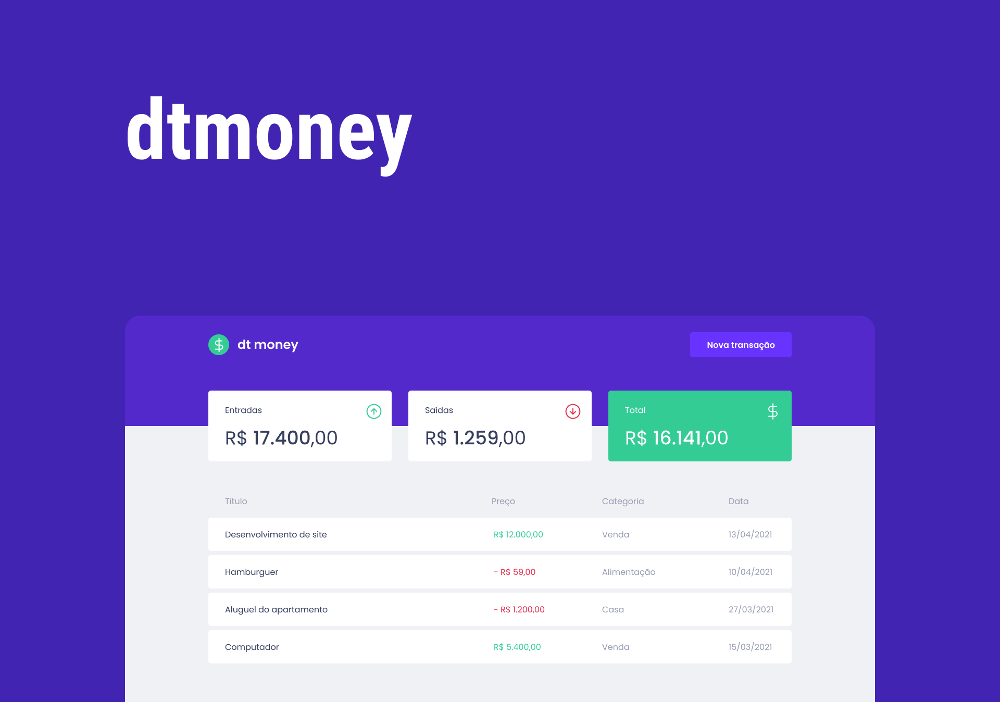

<h1 align="center">
  dtmoney
</h1>

<p align="center">
  <a href="#-features">Features</a>&nbsp;&nbsp;&nbsp;|&nbsp;&nbsp;&nbsp;
  <a href="#-project">Project</a>&nbsp;&nbsp;&nbsp;|&nbsp;&nbsp;&nbsp;
  <a href="#-starting">Starting</a>&nbsp;&nbsp;&nbsp;|&nbsp;&nbsp;&nbsp;
  <a href="#memo-license">License</a>
</p>

<p align="center">
  
  
  

  
</p>

<br>

<p align="center">
  
</p>

## 🚀 Technologies

The following tools were used in this project:

- [React](https://pt-br.reactjs.org/)
- [TypeScript](https://www.typescriptlang.org/)
- [Styled Components](https://styled-components.com/)
- [Polished](https://polished.js.org/)
- [Axios](https://github.com/axios/axios)
- [MirageJS](https://miragejs.com/)

## 💻 Project

ReactJS + TypeScript project with MirageJS for fake backend and stylized with Styled Components. Calculates a person's financial income with deposits, withdraws and total.

## 🏁 Starting

```bash
# Clone this project
$ git clone https://github.com/murilorvargas/dtmoney
# Access
$ cd dtmoney
# Install dependencies
$ yarn
# Run the project
$ yarn start
# The server will initialize in the <http://localhost:3000>
```

## :memo: License

This project is under license from MIT. For more details, see the [LICENSE](LICENSE) file.